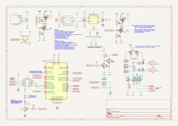

# drempelbox

kids friendly audio system

## Building

### Using cross

This project uses [cross](https://github.com/cross-rs/cross/) for compiling to different target architectures.
Cross requires a regular rust install via [rustup](https://rustup.rs/), docker or podman, and a Linux kernel mit binmft_misc support, see also [cross dependencies](https://github.com/cross-rs/cross/#dependencies).

Then install cross using cargo:
```bash
cargo install cross --git https://github.com/cross-rs/cross
```

To build for 64bit RaspberryPi OS (aarch64-unknown-linux-gnu), use
```bash
make build-aarch64-unknown-linux-gnu
```

To build for build-x86_64-unknown-linux-gnu, use
```bash
make build-aarch64-unknown-linux-gnu
```

Cross uses a containerized build environment to make cross compilation easy, install any
external dependencies for the build step in [Dockerfile.cross](Dockerfile.cross).
Docker [buildx](https://docs.docker.com/build/architecture/#install-buildx) is required for monitoring the build progress.

### Building directly on the host

You can also build this project directly on your host machine (for its architecture) using just cargo.
You will need to install the ALSA dev libs for your system, though (libasound2-dev on many platforms).

### Building on the RaspberryPi

***Don't do this unless you really need to! Compiling on the Zero 2W is very slow!***

To install the rust toolchain on the Zero 2W, you need to increase swap size.
From https://gist.github.com/tstellanova/0a6d8a70acc58a0d5be13ebaa7c935d4

```bash
sudo dphys-swapfile swapoff
sudo nano /etc/dphys-swapfile
```

Change `CONF_SWAPSIZE=100` to `CONF_SWAPSIZE=512` (or 1024)

```bash
sudo dphys-swapfile setup
sudo dphys-swapfile swapon
sudo reboot
```

Change to any swap size you feel appropriate for your needs.

## Running on RPi Zero 2W

Assuming a 64 bit RaspberryPI OS lite, install these packages to enable audio support:
- pipewire
- pipewire-alsa

Enable SPI for NFC ready support (using the raspi-config tool, for example).

Modify `/boot/firmware/config.txt`, adding this line at the end:
```
dtoverlay=gpio-poweroff,gpiopin=4,active_delay_ms=5000,inactive_delay_ms=1000,active_low=1
```
This enables the Pi to keep itself powered during normal operation
and switch itself off after poweroff. See the [schematic](#schematic) for details.

Create the service user and its group:
`sudo adduser --system --no-create-home --group drempelbox`

Add the user to these system groups to give it the necessary permissions:
```bash
sudo usermod -a -G gpio drempelbox
sudo usermod -a -G audio drempelbox
sudo usermod -a -G spi drempelbox
```

Create a polkit rule to allow the user to shutdown the system.
Create the file `/etc/polkit-1/rules.d/40-allow-shutdown.rules` and add these contents:
```
/* Allow members of the drempelbox group to shutdown without authentication */
polkit.addRule(function(action, subject) {
   if ( ( action.id == "org.freedesktop.login1.power-off" ||
          action.id == "org.freedesktop.login1.power-off-multiple-sessions"
        ) && subject.isInGroup("drempelbox") ) {
     polkit.log("Powering Off permitted for subject" + subject)
     return polkit.Result.YES;
   }
});
```

Restart the system or the polkit service for the changes to take effect:
```bash
systemctl restart polkit.service
```

## Hardware

Rough block diagram of system components:


### Schematic



## Software


